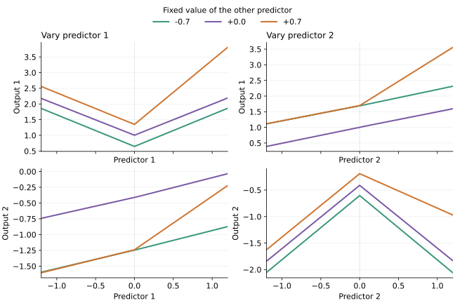

```@meta
CurrentModule = LinearTrees
```

# Continuous trees

[`fit_continuous_tree`](@ref) fits a multivariate regression tree whose joined
leaf polynomials agree on every shared face. The resulting function is
continuous across the whole predictor space. It is a separate model family
from [`fit_tree`](@ref): it uses conjugate normal-noise regression and marginal
evidence rather than a selectable loss.

## Fit and predict

Rows of `X` are observations and columns are numeric predictors. Both `X` and
`y` must be finite. A vector target fits one output; an `n × q` matrix fits `q`
independent output posteriors with shared tree geometry and design.

```@example continuous
using LinearTrees

grid = collect(range(-1.0, 1.0; length=15))
X = reduce(vcat, ([x1 x2] for x1 in grid for x2 in grid))
y = 1 .+ abs.(X[:, 1]) .+ 0.5X[:, 2] .+
    max.(X[:, 1], 0) .* max.(X[:, 2], 0)

model = fit_continuous_tree(X, y;
    pairs=[(1, 2)], max_splits=3, n_thresholds=1, min_leaf=10)

location = predict(model, X)
(length(location), all(isfinite, location))
```

Use [`predict!`](@ref) when an output buffer is already available. For a
vector target, both methods use a length-`n` vector. For a matrix target, they
use an `n × q` matrix.

```@example continuous
out = similar(location)
predict!(out, model, X)
out == location
```

## Predictive uncertainty

[`predictive`](@ref) returns a named tuple `(location, scale2, dof)` describing
the marginal Student-t distribution at each query row. The default
`observation=true` includes observation noise. Set `observation=false` for the
latent mean function.

```@example continuous
posterior = predictive(model, X; observation=false)
(size(posterior.location), size(posterior.scale2), posterior.dof > 0)
```

For a vector target, `location` and `scale2` are vectors and `dof` is a scalar.
For an `n × q` target, the first two are `n × q` matrices and `dof` is a
length-`q` vector. Student-t `scale2` is its squared scale parameter, not its
variance. When `dof > 2`, the variance is `scale2 * dof / (dof - 2)`.

These distributions condition on the chosen tree, pair graph, training-data
normalization, and hyperparameters. They do not include uncertainty from model
selection or preprocessing.



This four-leaf tree fits two outputs on a two-predictor grid. Each panel varies
one predictor while holding the other fixed. The dotted line marks a split.
The fitted lines meet there, while their slopes can change. The plot sources
are `bench/continuous_slices.jl` and `bench/continuous_slices.py`.

## Leaf model and continuity

Each leaf uses an intercept, every main effect, and selected pair products:

```math
f_\ell(x) = \theta_{\ell,0} + \sum_j \theta_{\ell,j}x_j
             + \sum_{(j,k)\in E}\theta_{\ell,jk}x_jx_k.
```

Set `pairs=:none` for main effects only, `pairs=:all` for every pair, or pass a
vector such as `[(1, 2), (2, 3)]`. Pair indices refer to columns of `X`.
Automatic pair selection is not part of the public interface.

Equality of the complete polynomial traces on each shared leaf face makes
every coordinate slice continuous and piecewise linear. Derivatives need not
be continuous. The basis has no interactions above order two, so it cannot
represent a general three-way interaction.

Prediction routes a row to one leaf and evaluates that leaf polynomial. It
does not clip predictors to their training ranges, so the fitted polynomial
extrapolates outside the observed region.

## Conditional posterior

Predictors and each target coordinate are normalized using training rows only;
the fitted transforms are stored and reused at prediction. A constant target
uses scale one. The solver uses `Float64`.

Let `D` be the raw routed leaf design and let `C\theta=0` collect all face
constraints. An orthonormal nullspace basis `N` gives `\theta=N\beta` and
`B=DN`. With coefficient precision `\lambda`,

```math
\beta\mid\sigma^2 \sim \mathcal N(0,\sigma^2\lambda^{-1}I),
\qquad \sigma^2 \sim \operatorname{InverseGamma}(a_0,b_0).
```

For normalized target `z`, the posterior uses

```math
\Lambda=B^\mathsf{T}B+\lambda I,\quad
m=\Lambda^{-1}B^\mathsf{T}z,\quad
a=a_0+n/2,
```

```math
b=b_0+\tfrac12\left(\lVert z-Bm\rVert^2+\lambda\lVert m\rVert^2\right).
```

At projected query row `r`, the Student-t distribution has `2a` degrees of
freedom and normalized scale squared
`(b/a) * (1 + r' * inv(Λ) * r)` for an observation. The latent version omits
the `1`. Location and scale are transformed back to the response units.

The coefficient prior is isotropic in the orthonormal continuous subspace of
raw leaf coefficients. Changing tree geometry can therefore change the
function prior even when two geometries span the same functions.

## Growth and search

The default `candidate_search=:full` retains single splits, paired sibling
splits, and three-split crosses. Growth is greedy: each round accepts the best
improving candidate under summed output log evidence and charges the geometry
complexity once. It is not a global optimization over trees.

`candidate_search=:graph_pruned` is an explicit approximation. It removes only
cross candidates unsupported by `pairs`; all single and sibling candidates
remain available. This can miss useful off-graph coordinated moves.

With a positive integer `n_thresholds`, each predictor gets that many equally
spaced cut positions in its normalized training range. The same global grid is
used throughout growth. Set `n_thresholds=nothing` to consider midpoints
between all distinct training values. `min_leaf`, `max_depth`, and `max_splits`
still restrict eligible trees. A zero-variance predictor is accepted but has
no split candidate.

Incremental constraint reuse is an internal optimization and does not alter
the interface or fitted model.

## Benchmarks

`bench/continuous.jl` compares these models on the UCI
[Airfoil Self-Noise](https://doi.org/10.24432/C5VW2C) and
[Yacht Hydrodynamics](https://doi.org/10.24432/C5XG7R) datasets. It verifies the
download hashes and uses three fixed 75/25 splits with no test-set tuning.
The source includes dataset attribution under CC BY 4.0.

```julia
include("bench/continuous.jl")  # use the bench environment
results = ContinuousBench.realdata()
reuse = ContinuousBench.reuse_benchmark()
```

These are small comparison cases, not a ranking across regression tasks.
PILOT fitting and continuous fitting use different objectives and size limits.
Continuity requires global coefficient solves, so fitting usually costs more.
Interaction terms can improve accuracy but also increase this cost.

`bench/continuous_typecheck.jl` runs JET checks on fitting and prediction.
`ContinuousBench.profile_fit(path)` writes a CPU profile for PProf without
opening a server. Pass `allocation_path` to collect an allocation profile.

## Scope and persistence

Continuous trees currently accept only numeric matrices. Existing categorical
features, loss types, boosting, SHAP, table and MLJ wrappers, and
[`to_dict`](@ref)/[`from_dict`](@ref) do not apply to [`ContinuousTree`](@ref).
JLD2 can save the Julia object graph without a package-specific format.

The principal fitting keywords and defaults are:

| Keyword | Default | Meaning |
|:--|:--|:--|
| `pairs` | `:none` | Pair products in every leaf |
| `candidate_search` | `:full` | Full or graph-pruned candidate family |
| `max_splits` | `6` | Total accepted split budget |
| `max_depth` | `4` | Maximum recursive split depth |
| `min_leaf` | `8` | Minimum rows in each new leaf |
| `n_thresholds` | `3` | Global grid size, or `nothing` for all midpoints |
| `split_penalty` | `2.0` | Evidence penalty per accepted split |
| `coefficient_precision` | `0.01` | `\lambda` in the coefficient prior |
| `noise_shape` | `2.0` | Inverse-gamma shape `a_0` |
| `noise_rate` | `1.0` | Inverse-gamma rate `b_0` |
